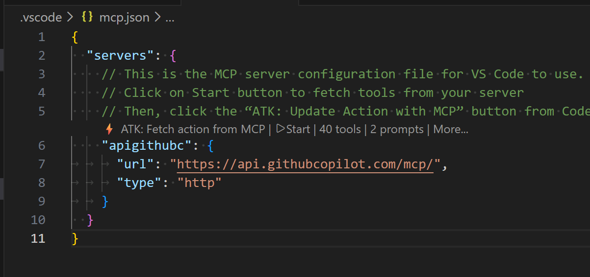
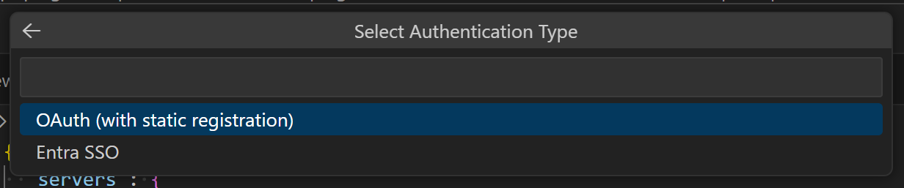
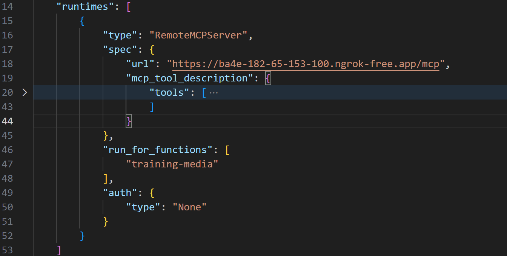

# Build Declarative Agent using M365 Agents Toolkit (ATK)

This document provides a step-by-step guide to building a Declarative Agent in Copilot integrated with your Remote MCP tools.

Your MCP tools can return rich interactive UI components. Microsoft 365 Copilot supports UI widgets created using the following methods:

- **MCP Apps** — An extension to MCP that enables MCP servers to deliver interactive user interfaces to hosts.
- **OpenAI Apps SDK** — Tools to build ChatGPT apps based on the MCP Apps standard with extra ChatGPT functionality.

For either approach, the instructions below are the same.

## Prerequisites

- Requirements specified in [Requirements for Copilot extensibility options](https://review.learn.microsoft.com/en-us/microsoft-365-copilot/extensibility/prerequisites#requirements-for-copilot-extensibility-options)
- A remote MCP server that provides UI widgets or that you can modify to implement UI widgets
- A tool to view MCP server responses, such as [MCP Inspector](https://www.npmjs.com/package/@modelcontextprotocol/inspector)
- [Visual Studio Code](https://code.visualstudio.com/)
- The latest prerelease version of [Microsoft 365 Agents Toolkit](https://marketplace.visualstudio.com/items?itemName=TeamsDevApp.ms-teams-vscode-extension) version 6.5.2x or later

## Create a declarative agent

1. Open Visual Studio Code and select the **Microsoft 365 Agents Toolkit** icon in the left-hand Activity Bar.
2. Select **Create a New Agent/App** in the Agents Toolkit task pane.

   

3. Select **Declarative Agent**.
4. Select **Add an Action**, then select **Start with an MCP Server**. If prompted, choose **Remote MCP server**.
5. Enter the URL to your MCP server.
6. Choose a location for the agent project.
7. Enter a name for the agent.

When you complete these steps, Agents Toolkit generates the required files for the agent and opens a new Visual Studio Code window with the agent project loaded.

## Update and sideload the agent

1. Open the `.vscode/mcp.json` file. Select the **Start** button in the file editor.
2. Select the **ATK: Fetch action from MCP** button in the file editor, then select `ai-plugin.json`.

   

3. Select the tools for the agent to use and select **OK**. Be sure to select at least one tool that has a UI widget.
4. Select the applicable authentication type.

   

   > **Important**
   >
   > If your MCP server is in development and doesn't implement authentication, this step is skipped. You need to manually add authentication to your manifest once you add authentication to your server.

5. Open `ai-plugin.json` and locate the `mcp_tool_description` property. Replace the existing value with the `tools/list` response JSON from your MCP server. Use a testing tool such as [MCP Inspector](https://www.npmjs.com/package/@modelcontextprotocol/inspector) to get the response from your server.

   

   > **Note**
   >
   > This step is temporary during the public preview. Agents Toolkit will be updated to make this step unnecessary in the future.

6. Select the **Microsoft 365 Agents Toolkit** icon in the left-hand Activity Bar.
7. In the **Accounts** pane, select **Sign in to Microsoft 365**. (If you're already signed in, continue to the next step).
8. Confirm that both **Custom App Upload Enabled** and **Copilot Access Enabled** display under your Microsoft 365 account. If they don't, check with your organization admin. See [Requirements for Copilot extensibility options](https://review.learn.microsoft.com/en-us/microsoft-365-copilot/extensibility/prerequisites#requirements-for-copilot-extensibility-options) for details.
9. In the **Lifecycle** pane, select **Provision**.
10. If prompted, add your authentication details.
11. Wait for the toolkit to report that it finishes provisioning.

## Test the agent

1. Open your browser and go to [https://m365.cloud.microsoft/chat](https://m365.cloud.microsoft/chat).
2. Select your agent in the left-hand sidebar. If you don't see your agent, select **All agents**.
3. Ask the agent to do something that invokes your MCP server.
4. Allow the agent to connect to the MCP server when prompted.
5. The agent renders the UI widget.

# Copilot supported capabilities

Microsoft 365 Copilot supports the following capabilities.

### Component bridge

| OpenAI Apps SDK | MCP Apps equivalent | Supported? |
| --- | --- | --- |
| window.openai.toolInput | app.ontoolinput | ✅ |
| window.openai.toolOutput | app.ontoolresult | ✅ |
| window.openai.toolResponseMetadata | app.ontoolresult → params._meta | ✅ |
| window.openai.widgetState | — | ✅ |
| window.openai.setWidgetState(state) | Not directly available. Use alternative mechanisms including app.updateModelContext() | ✅ |
| window.openai.callTool(name, args) | app.callServerTool({ name, arguments }) | ✅ |
| window.openai.sendFollowUpMessage({ prompt }) | app.sendMessage({ ... }) | ✅ |
| window.openai.uploadFile(file) | — | ❌ |
| window.openai.getFileDownloadUrl({ fileId }) | — | ❌ |
| window.openai.requestDisplayMode(...) | app.requestDisplayMode({ mode }) | ✅ (full screen only) |
| window.openai.requestModal(...) | — | ❌ |
| window.openai.notifyIntrinsicHeight(...) | app.sendSizeChanged({ width, height }) | ✅ |
| window.openai.openExternal({ href }) | app.openLink({ url }) | ✅ |
| window.openai.setOpenInAppUrl({ href }) | — | ✅ |
| window.openai.theme | app.getHostContext()?.theme | ✅ |
| window.openai.displayMode | app.getHostContext()?.displayMode | ✅ |
| window.openai.maxHeight | app.getHostContext()?.viewport?.maxHeight | ✅ |
| window.openai.safeArea | app.getHostContext()?.safeAreaInsets | ✅ |
| window.openai.view | — | ✅ |
| window.openai.userAgent | app.getHostContext()?.userAgent | ✅ |
| window.openai.locale | app.getHostContext()?.locale | ✅ |
| — | app.ontoolinputpartial | ❌ |
| — | app.ontoolcancelled | ❌ |
| — | app.getHostContext()?.availableDisplayModes | ❌ |
| — | app.getHostContext()?.toolInfo | ❌ |
| — | app.onhostcontextchanged | ❌ |
| — | app.onteardown | ❌ |
| — | app.sendLog({ level, data }) | ❌ |
| — | app.getHostVersion() | ❌ |
| — | app.getHostCapabilities() | ✅ |

### Tool descriptor _meta fields

| OpenAI Apps SDK | MCP Apps equivalent | Supported? |
| --- | --- | --- |
| _meta["openai/outputTemplate"] | _meta.ui.resourceUri | ✅ |
| _meta["openai/widgetAccessible"] | _meta.ui.visibility (string[]) | ❌ |
| _meta["openai/visibility"] | _meta.ui.visibility (string[]) | ✅ |
| _meta["openai/toolInvocation/invoking"] | — | ❌ |
| _meta["openai/toolInvocation/invoked"] | — | ❌ |
| _meta["openai/fileParams"] | — | ❌ |
| _meta["securitySchemes"] | — | ❌ |

### Tool descriptor annotations

| OpenAI Apps SDK | MCP Apps equivalent | Supported? |
| --- | --- | --- |
| readOnlyHint | readOnlyHint | ✅ |
| destructiveHint | destructiveHint | ❌ |
| openWorldHint | openWorldHint | ❌ |
| idempotentHint | idempotentHint | ❌ |

### Component resource _meta fields

| OpenAI Apps SDK | MCP Apps equivalent | Supported? |
| --- | --- | --- |
| _meta["openai/widgetDescription"] | — | ❌ |
| _meta["openai/widgetPrefersBorder"] | _meta.ui.prefersBorder | ❌ |
| _meta["openai/widgetCSP"] | _meta.ui.csp | ✅ |
| _meta["openai/widgetDomain"] | _meta.ui.domain | ❌ |
| — | _meta.ui.permissions | ❌ |

### Properties in CSP object

| OpenAI Apps SDK | MCP Apps equivalent | Supported? |
| --- | --- | --- |
| connect_domains | connectDomains | ✅ |
| resource_domains | resourceDomains | ✅ |
| frame_domains | frameDomains | ❌ |
| redirect_domains | — | ❌ |
| — | baseUriDomains | ❌ |

### Host-provided tool result _meta fields

| OpenAI Apps SDK | MCP Apps equivalent | Supported? |
| --- | --- | --- |
| _meta["openai/widgetSessionId"] | — | ❌ |

### Client-provided _meta fields

| OpenAI Apps SDK | MCP Apps equivalent | Supported? |
| --- | --- | --- |
| _meta["openai/locale"] | _meta["openai/locale"] | ✅ |
| _meta["openai/userAgent"] | _meta["openai/userAgent"] | ✅ |
| _meta["openai/userLocation"] | _meta["openai/userLocation"] | ✅ |
| _meta["openai/subject"] | — | ❌ |