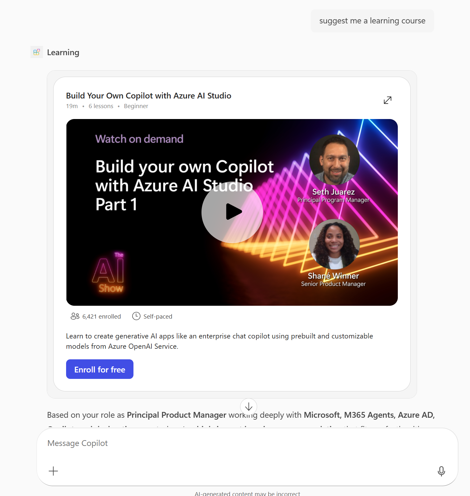
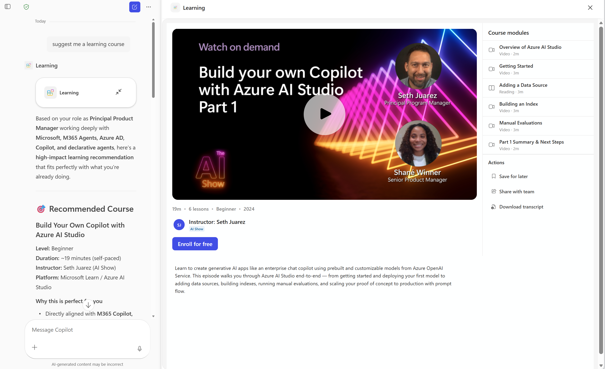

# Employee Training (MCP App Server)

## 1. What this sample is about

This directory contains a minimal **Model Context Protocol (MCP) App Server** that recommends learning and training courses with embedded video previews. Built with React, Fluent UI v9, and the MCP Apps SDK, it exposes a UI-bearing tool so you can experiment with Copilot tool invocation and widget rendering end-to-end.

The sample includes:

- `training-media` — Learning course recommendation with inline entity card and fullscreen video view





### Features

- **Learning Course Recommendation** — Accepts an optional topic query and randomly selects a matching course
- **Inline Entity Card** — Compact card with embedded video, metadata badges, and enroll button
- **Fullscreen View** — Expanded layout with video player, course modules sidebar, instructor info, and related courses

## 2. Sample prompts

| Prompt | What it does |
|---|---|
| Recommend a training course about AI agents. | Calls `training-media` with query "agents" and shows a matching course card with embedded video. |
| Show me a course on Semantic Kernel. | Calls `training-media` with query "semantic kernel" and renders the course widget. |
| What training is available for Azure AI? | Calls `training-media` with query "azure ai" and returns a recommended course. |
| Suggest a learning resource for building copilots. | Calls `training-media` with query "copilot" and displays the course card. |

## 3. Pre-requisites

### Required (to run locally)

- Node.js 20+ (or current LTS)
- npm 10+

## 4. Development (run locally + dev tunnel)

### Step 1: Clone this repo and navigate to the employee-training folder (PowerShell)

```powershell
git clone https://github.com/rabwill/mcp-interactive-ui-samples.git
cd mcp-interactive-ui-samples/mcp-apps/employee-training/node
```

### Step 2: Install Node.js and npm (skip if already installed)

Check if Node.js and npm are already installed:

```bash
node -v
npm -v
```

If both commands return version numbers (Node.js 20+ and npm 10+), skip to Step 3. Otherwise, install them:

#### Windows (PowerShell)

```powershell
winget install OpenJS.NodeJS.LTS
```

#### macOS (Terminal)

```bash
brew install node
```

### Step 3: Run locally

```bash
npm install
npm run build
npm run dev
```

Server endpoint:

- `http://localhost:3001/mcp`

### Expose via dev tunnel (example with ngrok)

```bash
ngrok http 3001
```

Use the public HTTPS URL from ngrok and append `/mcp` for your MCP spec URL.

## 5. How to test in Copilot

### Quick test

1. Open [appPackage/ai-plugin.json](appPackage/ai-plugin.json).
2. Replace the spec URL with your local tunnel MCP URL from section 4.

	 ```json
	 "runtimes": [
		 {
			 "type": "RemoteMCPServer",
			 "spec": {
				 "url": "<your-mcp-server-url>",
				 "x-mcp_tool_description": {
					 "...": "..."
				 }
			 }
		 }
	 ]
	 ```
3. Zip the [appPackage](appPackage) folder.
4. Sideload the package into Teams.

If you are customizing tool definitions (adding/updating tools), you can use M365 Agent Toolkit to create a declarative agent from your MCP server URL.

## 6. Next steps

- Customize course data in `mock-data/training-media.ts`
- Add more tools and UI widgets
- Create your own components
