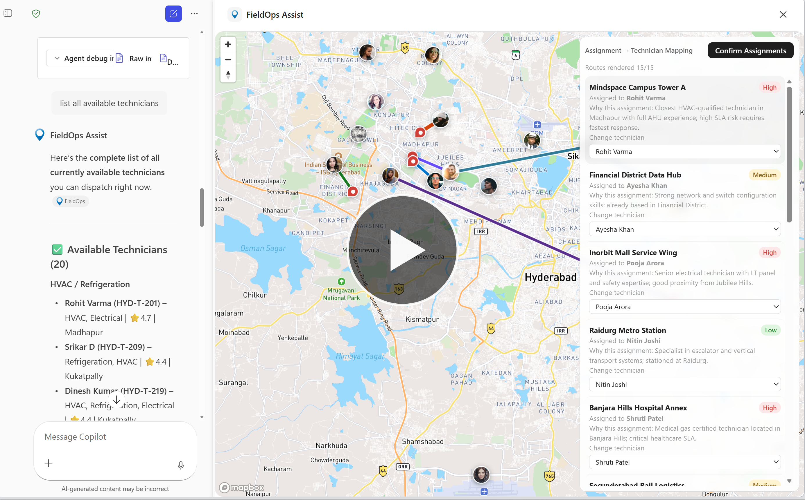
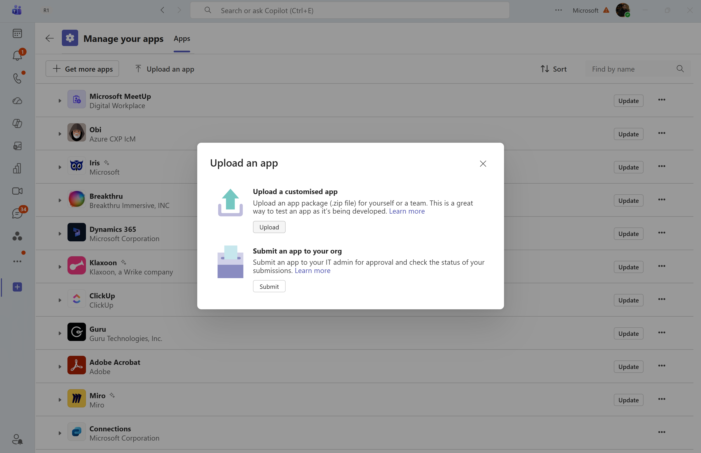

# Field Service Dispatch Agent (MCP Apps)

## 1. What this sample is about

This directory contains a minimal **Model Context Protocol (MCP) server** implemented with the official TypeScript SDK and [MCP Apps](https://github.com/modelcontextprotocol/ext-apps) (`@modelcontextprotocol/ext-apps`) for a field service dispatch workflow. It exposes UI-bearing tools (list, map, dispatch plan, confirmation) so you can experiment with Copilot tool invocation and widget rendering end-to-end.

The sample includes:

- `list-new-assignments` for intake
- `show-assignments-on-map` for map visualization
- `get-available-technicians` + `create-dispatch-plan` for planning
- `commit-assignments` for confirmation/commit flow

## 2. Demo video

[](https://www.youtube.com/watch?v=rsfPzTxCgjQ)

- Demo video file: [demos/demo-video.mp4](../../demos/demo-video.mp4)
- Watch demo on YouTube: https://www.youtube.com/watch?v=rsfPzTxCgjQ


## 3. Sample prompts

| Prompt | What it does |
|---|---|
| Show me new assignments from the last 24 hours. | Calls `list-new-assignments` and opens the list widget with filtered intake items. |
| Show these assignments on the map. | Calls `show-assignments-on-map` and renders the dispatch map widget. |
| List available technicians. | Calls `get-available-technicians` to retrieve available workforce candidates. |
| Create a dispatch plan for these assignments. | Calls `create-dispatch-plan` with assignment/technician mappings and shows planning UI. |

## 4. Pre-requisites

### Required (to run locally)

- Node.js 20+ (or current LTS)
- npm 10+
- A **Mapbox public access token** (free tier is sufficient to test) — needed for the map and dispatch-plan widgets

### Get a Mapbox access token

1. Go to [https://account.mapbox.com/auth/signup/](https://account.mapbox.com/auth/signup/) and create a free Mapbox account (or sign in if you already have one).
2. Navigate to **Account → Tokens**: [https://account.mapbox.com/access-tokens/](https://account.mapbox.com/access-tokens/).
3. Copy your **Default public token** (starts with `pk.`).
4. Open the following two widget files and replace `YOUR_MAPBOX_ACCESS_TOKEN` with your token:
   - [`widgets/src/dispatch-map/DispatchMap.tsx`](widgets/src/dispatch-map/DispatchMap.tsx)
   - [`widgets/src/dispatch-plan/DispatchPlan.tsx`](widgets/src/dispatch-plan/DispatchPlan.tsx)


## 5. Development (run locally + dev tunnel)

### Step 1: Clone this repo and navigate to the fieldops folder (PowerShell)

```powershell
git clone https://github.com/rabwill/mcp-interactive-ui-samples.git
cd mcp-interactive-ui-samples/mcp-apps/fieldops/node/src/mcpserver
```

### Step 2: Install Node.js and npm (skip if already installed)

Check if Node.js and npm are already installed:

```bash
node -v
npm -v
```

If both commands return version numbers (Node.js 20+ and npm 10+), skip to Step 3. Otherwise, install them:

#### Windows (PowerShell)

```powershell
winget install OpenJS.NodeJS.LTS
```

#### macOS (Terminal)

```bash
brew install node
```

### Step 3: Run locally

```bash
npm run install:all
npm run build:widgets
npm run dev:server
```

Server endpoint:

- `http://localhost:8787/mcp`

### Expose via dev tunnel (example with ngrok)

```bash
ngrok http 8787
```

Use the public HTTPS URL from ngrok and append `/mcp` for your MCP spec URL.

## 6. How to test in Copilot

### Quick test

1. Open [appPackage/ai-plugin.json](../../appPackage/ai-plugin.json).
2. Replace the spec URL with your local tunnel MCP URL from section 5.

	 ```json
	 "runtimes": [
		 {
			 "type": "RemoteMCPServer",
			 "spec": {
				 "url": "<your-mcp-server-url>",
				 "x-mcp_tool_description": {
					 "...": "..."
				 }
			 }
		 }
	 ]
	 ```
3. Zip the [appPackage](../../appPackage) folder.
4. Sideload the package into Teams.



If you are customizing tool definitions (adding/updating tools), you can use M365 Agents Toolkit to create a declarative agent from your MCP server URL. See [M365 Agents Toolkit Instructions](../../../../../M365-Agents-Toolkit-Instructions.md) for details.

## 7. Next steps

- Customize data sources for your environment
- Create your own components
