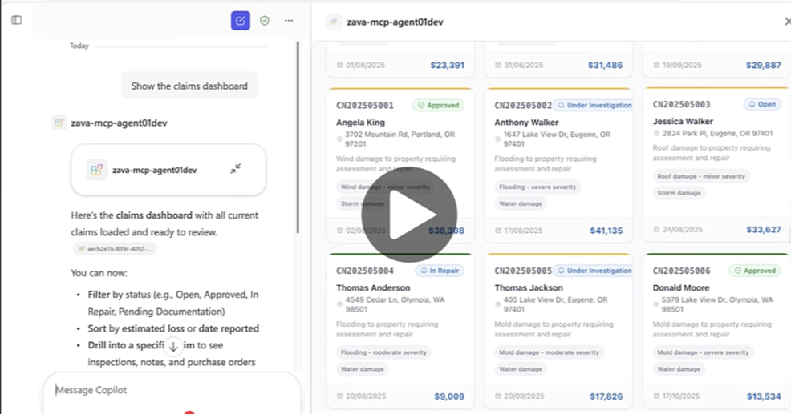

# Zava Insurance — MCP Server

An MCP (Model Context Protocol) server for **Zava Insurance** that exposes claims management tools and rich interactive widgets using [MCP Apps](https://github.com/modelcontextprotocol/ext-apps) (`@modelcontextprotocol/ext-apps`). Compatible with any MCP Apps-capable host such as Claude, ChatGPT, and Microsoft 365 Copilot.

<a href="https://www.youtube.com/watch?v=1zrWTtuDaQk" target="_blank"></a>

> **<a href="https://www.youtube.com/watch?v=1zrWTtuDaQk" target="_blank">Watch the demo on YouTube</a>** | [Demo video file](../../demos/zava-oai.mp4)

## Prerequisites

| Requirement | Version |
|---|---|
| [Node.js](https://nodejs.org/) | 18, 20, or 22 |
| npm | ≥ 9 |

Azurite is included as a dev dependency — no separate install needed.

## Getting Started

> All commands below should be run from the `src/mcpserver/` directory.

### 1. Install dependencies

```bash
npm run install:all
```

This installs packages for the root, server, and widgets workspaces.

### 2. Start Azurite (local Azure Table Storage)

Open a **separate terminal** and run:

```bash
npm run start:azurite
```

This starts the local Azure Table Storage emulator on port 10002. **Keep this terminal running** throughout development.

### 3. Seed the database

In a **new terminal** (with Azurite still running):

```bash
npm run seed
```

Populates the local database with sample claims, inspections, purchase orders, contractors, and inspectors.

### 4. Create your `.env` file

Copy the sample environment file:

```bash
cp .env.sample .env
```

Open `.env` and verify the values:

```dotenv
# Azure Table Storage (Azurite for local dev)
AZURE_STORAGE_CONNECTION_STRING=DefaultEndpointsProtocol=http;AccountName=devstoreaccount1;AccountKey=Eby8vdM02xNOcqFlqUwJPLlmEtlCDXJ1OUzFT50uSRZ6IFsuFq2UVErCz4I6tq/K1SZFPTOtr/KBHBeksoGMGw==;TableEndpoint=http://127.0.0.1:10002/devstoreaccount1;

# Server port
PORT=3001
```

> The defaults in `.env.sample` are pre-configured for local Azurite development — no changes needed unless you're using a different storage account.

### 5. Build the widgets

```bash
npm run build:widgets
```

Compiles the React + Fluent UI widgets into single-file HTML assets in the `assets/` folder.

### 6. Start the MCP server

```bash
npm run start:server
```

The server starts on **http://localhost:3001** with the MCP endpoint at **http://localhost:3001/mcp**.

### 7. Test the server (MCP Inspector)

With the server running, open a **new terminal** and launch the [MCP Inspector](https://modelcontextprotocol.io/docs/tools/inspector):

```bash
npm run inspector
```

This opens a browser-based UI where you can:

- Browse all registered tools and their schemas
- Call tools with custom inputs and inspect the JSON responses
- Verify that widget HTML is returned correctly

Use the Inspector to confirm the server is working before connecting it to Copilot.

## Connect to Microsoft 365 Copilot

To connect this MCP server to a Microsoft 365 Copilot Declarative Agent, see the [Zava Insurance Declarative Agent README](../../README.md) for full instructions on dev tunnel configuration, agent provisioning, and testing in Copilot.

## Tools

### Widget Tools (render interactive UI)

| Tool | Description |
|------|-------------|
| `show-claims-dashboard` | Grid view of all claims with status filters, metrics, and click-to-detail |
| `show-claim-detail` | Detailed view of a single claim with inspections, POs, and a map |
| `show-contractors` | Filterable list of contractors with ratings and specialties |

### Data Tools

| Tool | Description |
|------|-------------|
| `update-claim-status` | Update a claim's status and add notes |
| `update-inspection` | Update inspection status, findings, and recommended actions |
| `update-purchase-order` | Update a purchase order's status |
| `get-claim-summary` | Text summary of a specific claim |
| `list-inspectors` | List all inspectors with specializations |
| `create-inspection` | Create a new inspection record for a claim |

## Sample Prompts

| Prompt | What it does |
|--------|-------------|
| *Show the claims dashboard* | Opens the claims dashboard widget with all claims, status metrics, and click-to-detail |
| *Show me all open claims sorted by estimated loss from highest to lowest* | Opens the dashboard filtered to open claims and sorted by estimated loss descending — quickly surfaces the highest-value open claims |
| *Show me Kimberly King's claim details, and tell me what inspections are pending* | Fetches the claim detail widget for the specific policy holder and summarizes pending inspection status |
| *Show me the preferred roofing contractors* | Opens the contractors list filtered to preferred roofing specialists — useful when assigning repair work on storm or roof damage claims |
| *Approve claim 2 with a note that all documentation has been verified, then show me the updated dashboard* | Updates the claim status to Approved, adds a note, and re-opens the dashboard so you can confirm the change — a multi-step workflow in one prompt |
| *Create a high-priority initial inspection for claim CN202504990 scheduled for next Monday, and assign it to an inspector who specializes in fire damage* | Lists inspectors, picks one with fire damage specialization, and creates the inspection — chains three tools automatically |
| *Which claims have the highest estimated losses? Show me the top ones and compare their damage types* | Opens the dashboard sorted by estimated loss descending, then the AI analyzes damage types across high-value claims to surface patterns |
| *Show the claim detail for claim 1. Then approve the pending purchase order and mark the inspection as completed with findings noting that all repairs are satisfactory* | Chains claim detail view, purchase order approval, and inspection update in one conversation — replaces multiple manual steps |

## Development

```bash
npm run dev:server         # Server with hot-reload (tsx --watch)
npm run build:widgets      # Rebuild widgets after changes
npm run inspector          # Launch MCP Inspector for testing
```

## Project Structure

```
├── server/src/mcp-server.ts   # McpServer + registerAppTool / registerAppResource
├── server/src/index.ts        # Express entry point (Streamable HTTP transport)
├── server/src/db.ts           # Azure Table Storage data layer
├── widgets/src/
│   ├── claims-dashboard/      # Master-detail claims widget
│   ├── claim-detail/          # Standalone claim detail widget
│   ├── contractors-list/      # Contractors list widget
│   └── hooks/
│       ├── useMcpApp.tsx      # MCP Apps React context (App, useApp, theme)
│       └── useThemeColors.ts  # Color palette based on host theme
├── assets/                    # Built single-file HTML widgets
└── db/                        # Seed data (JSON)
```
