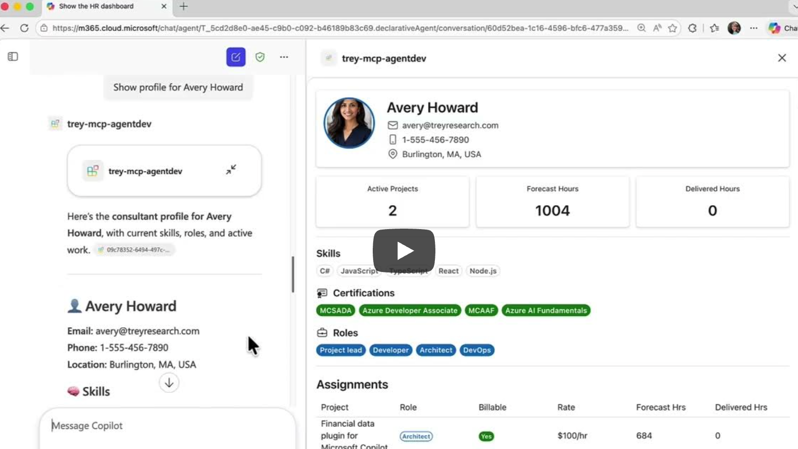

# Trey Research — Declarative Agent with MCP Server & Rich UI

A Microsoft 365 Copilot Declarative Agent that connects to the **Trey Research MCP Server**, enabling HR consultant management through natural language. The MCP server uses the **OpenAI App SDK** to render rich, interactive widgets directly inside the Copilot chat — including an HR dashboard, consultant profile cards, a bulk editor, and project detail views.

<a href="https://www.youtube.com/watch?v=kNXT7Syf9fQ" target="_blank"></a>

> **<a href="https://www.youtube.com/watch?v=kNXT7Syf9fQ" target="_blank">Watch the demo on YouTube</a>** | [Demo video file](demos/demo-video.mp4)

Built with the [Agents Toolkit (ATK)](https://aka.ms/teams-toolkit) in VS Code. Instead of hand-authoring an OpenAPI spec, ATK points at the MCP discovery URL and generates all manifests, wiring in tools and function definitions automatically.

## What This Agent Can Do

### Rich UI Tools (render interactive widgets in chat)

| Tool | Description |
|------|-------------|
| `show-hr-dashboard` | KPI dashboard of consultants and assignments with filters for name, project, skill, role, and billable status |
| `show-consultant-profile` | Detailed profile card for a consultant including contact info, skills, certifications, roles, and current assignments |
| `show-bulk-editor` | Editable grid view of consultant records with optional skill/name filters |
| `show-project-details` | Detailed project view with assigned consultants and forecasted hours |

### Data Tools

| Tool | Description |
|------|-------------|
| `search-consultants` | Search consultants by skill or name, results displayed in the bulk editor widget |
| `update-consultant` | Update a single consultant's name, email, phone, skills, or roles |
| `bulk-update-consultants` | Batch-update multiple consultant records at once |
| `assign-consultant-to-project` | Assign a consultant to a project with a role, optional billing rate, and forecast hours |
| `bulk-assign-consultants` | Assign multiple consultants to a project at once |
| `remove-assignment` | Remove a consultant's assignment from a project |


## Prerequisites

- [Node.js](https://nodejs.org/) 18, 20, or 22
- [Microsoft 365 Agents Toolkit](https://aka.ms/teams-toolkit) VS Code extension (v5.0.0+)
- [Microsoft 365 Copilot license](https://learn.microsoft.com/microsoft-365-copilot/extensibility/prerequisites#prerequisites)
- A [Microsoft 365 developer account](https://docs.microsoft.com/microsoftteams/platform/toolkit/accounts)

## Getting Started

1. Create a file `.env.dev` file (use the sample `.env.dev.sample`) inside the **env** folder in the root of the project.

2. **Run the setup commands:**


Run all scripts from `src/mcpserver/`

1. **Install dependencies** — run `npm run install:all`
2. **Start Azurite** (local storage emulator) — `npm run start:azurite` in a separate terminal
3. **Seed the database** — `npm run seed`
4. **Build widgets** — `npm run build:widgets`
5. **Start the MCP server** — `npm run dev:server` (runs on `http://localhost:3001/mcp`)
6. **Create a dev tunnel** — Use [Dev Tunnels](https://learn.microsoft.com/azure/developer/dev-tunnels/) to expose your local MCP server publicly:
   ```bash
   devtunnel host -p 3001 --allow-anonymous
   ```
   Copy the forwarded URL (e.g. `https://<tunnel-id>.devtunnels.ms`) and update the `url` field under the `RemoteMCPServer` runtime in `appPackage/ai-plugin.json`:
   ```json
   "runtimes": [
       {
           "type": "RemoteMCPServer",
           "spec": {
               "url": "https://<your-tunnel-url>/mcp"
           }
       }
   ]
   ```
7. Inside **src/mcpserver** folder  **create your `.env` file** — copy `.env.sample` and update `SERVER_BASE_URL` with your dev tunnel URL:
   ```bash
   cp .env.sample .env
   ```
   Then edit `.env` and replace the placeholder with your actual tunnel URL:
   ```
   SERVER_BASE_URL=https://<your-tunnel-id>-3001.aue.devtunnels.ms/
   ```
   > This URL is injected into the widgets so they can call back to the MCP server. Without it, widgets will default to `http://localhost:3001`.
8. **Provision & debug** — Use the **Provision** button from Agents Toolkit's **LifeCycle** panel.

## Sample Prompts

| Prompt | What it does |
|--------|-------------|
| *Show the HR dashboard* | Opens the HR consultant dashboard widget |
| *I need a React developer for the Copilot project at Consolidated Messenger. Find someone with React skills, show me their profile, and assign them as a Developer.* | Searches consultants by skill, displays a profile card, and assigns the consultant to a project — all by name, no IDs needed |
| *Show me the HR dashboard filtered to only billable assignments. Which consultants have the most forecasted hours, and are any of them over-allocated?* | Opens the interactive dashboard with a billable filter applied, then the AI analyzes forecast data across consultants to surface workload insights |
| *We need to staff the Disaster Recovery project at Relecloud. Show me the project details, then find all consultants who have Python or Java skills and bulk-assign them as Developers at $120/hr.* | Chains project lookup, skill-based consultant search, and bulk assignment in a single conversation — replacing multiple clicks across an HR system |
| *Compare Avery Howard and Sanjay Puranik — show me both their profiles side by side. Who has more certifications, and which projects are they currently assigned to?* | Fetches two consultant profiles by name and synthesizes a comparison of certifications, skills, and active assignments |

## Test the agent

1. Open your browser and go to [https://m365.cloud.microsoft/chat](https://m365.cloud.microsoft/chat).
2. Select your agent in the left-hand sidebar. If you don't see your agent, select **All agents**.
3. Ask the agent to do something that invokes your MCP server, use above table for reference to sample prompts.
4. Allow the agent to connect to the MCP server when prompted.
5. The agent renders the UI widget.


## Project Structure

| Folder | Description |
|--------|-------------|
| `appPackage/` | Agent manifests — `ai-plugin.json` (tool definitions & auth), `declarativeAgent.json` (agent config), `manifest.json` (Teams/Outlook integration) |
| `src/mcpserver/server/` | MCP server — Express + StreamableHTTP transport, Azure Table Storage data layer |
| `src/mcpserver/widgets/` | React 18 + Fluent UI v9 widgets built as single-file HTML via OpenAI App SDK (HR dashboard, consultant profile, bulk editor) |
| `src/mcpserver/assets/` | Pre-built widget HTML files served by the MCP server |
| `src/mcpserver/db/` | Seed data (JSON) — Consultants, Projects, Assignments |
| `env/` | Local environment files |
| `m365agents.yml` | ATK lifecycle configuration |

## Learn More

- [Build Declarative Agents](https://learn.microsoft.com/microsoft-365-copilot/extensibility/build-declarative-agents)
- [Build Declarative Agents for Microsoft 365 Copilot with MCP](https://devblogs.microsoft.com/microsoft365dev/build-declarative-agents-for-microsoft-365-copilot-with-mcp/)
- [Model Context Protocol (MCP)](https://modelcontextprotocol.io/)


