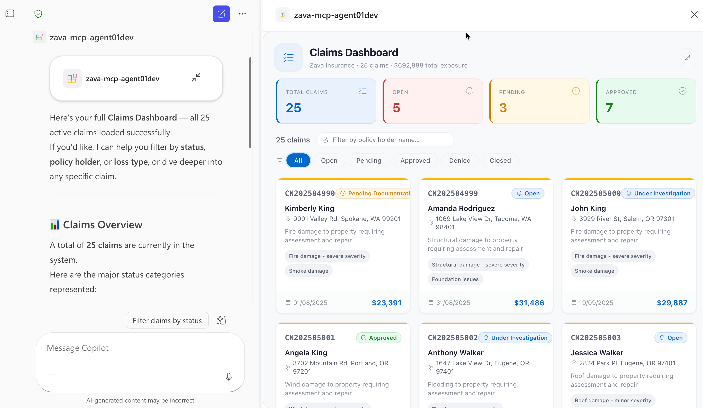
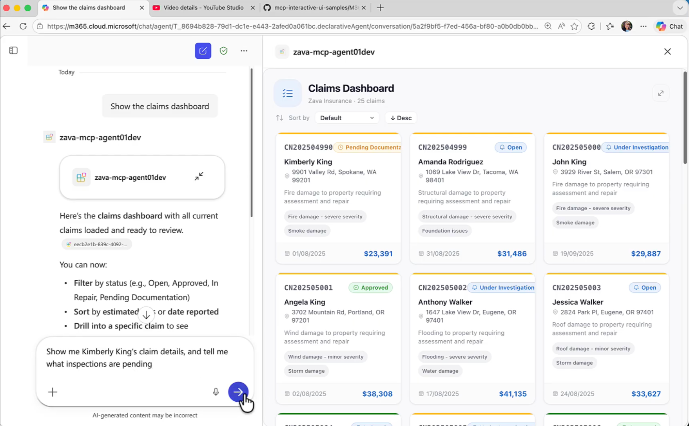

# Zava Insurance — Declarative Agent with MCP Server & Rich UI

A Microsoft 365 Copilot Declarative Agent that connects to the **Zava Insurance MCP Server**, enabling insurance claims management through natural language. The MCP server uses the **OpenAI App SDK** to render rich, interactive widgets directly inside the Copilot chat — including claims dashboards, claim detail views, and contractor lists.


<a href="https://www.youtube.com/watch?v=1zrWTtuDaQk" target="_blank"></a>

> **<a href="https://www.youtube.com/watch?v=1zrWTtuDaQk" target="_blank">Watch the demo on YouTube</a>** | [Demo video file](demos/zava-oai.mp4)

Built with the [Agents Toolkit (ATK)](https://aka.ms/teams-toolkit) in VS Code. Instead of hand-authoring an OpenAPI spec, ATK points at the MCP discovery URL and generates all manifests, wiring in tools and function definitions automatically.

## What This Agent Can Do

### Rich UI Tools (render interactive widgets in chat)

| Tool | Description |
|------|-------------|
| `show-claims-dashboard` | Grid view of all claims with status filters, metrics, and click-to-detail |
| `show-claim-detail` | Detailed view of a single claim with inspections, purchase orders, and a map |
| `show-contractors` | Filterable list of contractors with ratings and specialties |

### Data Tools

| Tool | Description |
|------|-------------|
| `update-claim-status` | Update a claim's status and add notes |
| `update-inspection` | Update inspection status, findings, and recommended actions |
| `update-purchase-order` | Update a purchase order's status |
| `get-claim-summary` | Text summary of a specific claim |
| `list-inspectors` | List all inspectors with specializations |

## Sample Prompts

| Prompt | What it does |
|--------|-------------|
| *Show the claims dashboard* | Opens the claims dashboard widget with all claims, status metrics, and click-to-detail |
| *Show me all open claims sorted by estimated loss from highest to lowest* | Opens the dashboard filtered to open claims and sorted by estimated loss descending — quickly surfaces the highest-value open claims |
| *Show me Kimberly King's claim details, and tell me what inspections are pending* | Fetches the claim detail widget for the specific policy holder and summarizes pending inspection status — saves toggling between screens |
| *Show me the preferred roofing contractors* | Opens the contractors list filtered to preferred roofing specialists — useful when assigning repair work on storm or roof damage claims |
| *Approve claim 2 with a note that all documentation has been verified, then show me the updated dashboard* | Updates the claim status to Approved, adds a note, and re-opens the dashboard so you can confirm the change — a multi-step workflow in one prompt |
| *Create a high-priority initial inspection for claim CN202504990 scheduled for next Monday, and assign it to an inspector who specializes in fire damage* | Lists inspectors, picks one with fire damage specialization, and creates the inspection — chains three tools automatically |
| *Which claims have the highest estimated losses? Show me the top ones and compare their damage types* | Opens the dashboard sorted by estimated loss descending, then the AI analyzes damage types across high-value claims to surface patterns |
| *Show the claim detail for claim 1. Then approve the pending purchase order and mark the inspection as completed with findings noting that all repairs are satisfactory* | Chains claim detail view, purchase order approval, and inspection update in one conversation — replaces multiple manual steps |


## Prerequisites

- [Node.js](https://nodejs.org/) 18, 20, or 22
- [Microsoft 365 Agents Toolkit](https://aka.ms/teams-toolkit) VS Code extension (v5.0.0+)
- [Microsoft 365 Copilot license](https://learn.microsoft.com/microsoft-365-copilot/extensibility/prerequisites#prerequisites)
- A [Microsoft 365 developer account](https://docs.microsoft.com/microsoftteams/platform/toolkit/accounts)

## Getting Started

1. **Create a file** `.env.dev` file (use the sample `.env.dev.sample`) inside the **env** folder in the root of the project.

2. **Run the setup commands:**

    Run all scripts from `src/mcpserver/`

    1. **Install dependencies** — run `npm run install:all`
    2. **Start Azurite** (local storage emulator) — `npm run start:azurite` in a separate terminal
    3. **Seed the database** — `npm run seed`
    4. **Build widgets** — `npm run build:widgets`
    5. **Start the MCP server** — `npm run dev:server` (runs on `http://localhost:3001/mcp`)
3. **Create a dev tunnel** — Use [Dev Tunnels](https://learn.microsoft.com/azure/developer/dev-tunnels/) to expose your local MCP server publicly:
    ```bash
    devtunnel host -p 3001 --allow-anonymous
    ```
    Copy the forwarded URL (e.g. `https://<tunnel-id>.devtunnels.ms`) and update the `url` field under the `RemoteMCPServer` runtime in `appPackage/ai-plugin.json`:
    ```json
    "runtimes": [
        {
            "type": "RemoteMCPServer",
            "spec": {
                "url": "https://<your-tunnel-url>/mcp"
            }
        }
    ]
    ```
4. Inside **src/mcpserver** folder  **create your `.env` file** — copy `.env.sample`:
    ```bash
    cp .env.sample .env
    ```
    > This file contains the Azure Table Storage connection string and server port used by the MCP server. The defaults in `.env.sample` are pre-configured for local Azurite development.

5. **Provision** — Use the **Provision** button from Agents Toolkit's **LifeCycle** panel.

## Test the agent

1. Open your browser and go to [https://m365.cloud.microsoft/chat](https://m365.cloud.microsoft/chat).
2. Select your agent in the left-hand sidebar. If you don't see your agent, select **All agents**.
3. Ask the agent to do something that invokes your MCP server, use above table for reference to sample prompts.
4. Allow the agent to connect to the MCP server when prompted.
5. The agent renders the UI widget.

## Project Structure

| Folder | Description |
|--------|-------------|
| `appPackage/` | Agent manifests — `ai-plugin.json` (tool definitions & auth), `declarativeAgent.json` (agent config), `manifest.json` (Teams/Outlook integration) |
| `src/mcpserver/server/` | MCP server — Express + StreamableHTTP transport, Azure Table Storage data layer |
| `src/mcpserver/widgets/` | React 18 + Fluent UI v9 widgets built as single-file HTML via OpenAI App SDK (claims dashboard, claim detail, contractors list) |
| `src/mcpserver/db/` | Seed data (JSON) |
| `env/` | Local environment files |
| `m365agents.yml` | ATK lifecycle configuration |

## Learn More

- [Build Declarative Agents](https://learn.microsoft.com/microsoft-365-copilot/extensibility/build-declarative-agents)
- [Build Declarative Agents for Microsoft 365 Copilot with MCP](https://devblogs.microsoft.com/microsoft365dev/build-declarative-agents-for-microsoft-365-copilot-with-mcp/)
- [Model Context Protocol (MCP)](https://modelcontextprotocol.io/)
